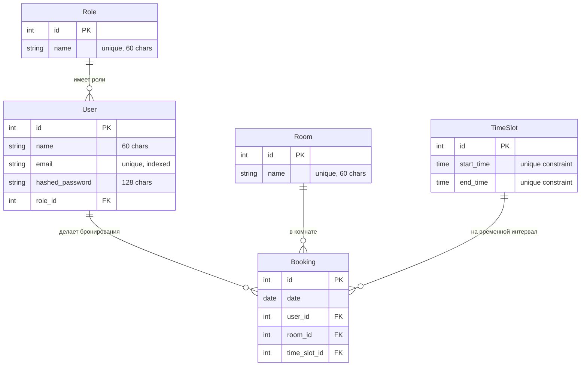

# Инструкция по запуску
Запуск сервиса можно сделать двумя способами: 
1. Полностью в докер контейнерах
2. Бэкенд на локальной ОС + БД в докер контейнере

## 1. Запуск через докер контейнеры
### Требования
- Docker
### Порядок запуска
- скачать проект

`git clone https://github.com/mshipilov/cft-project/tree/main`

`cd cft-project`
- запустить проект
`docker-compose up`

## 2. Бэкенд на локальной ОС + БД в докер контейнере
### Требования
- Python 3.11+
- Poetry
- Docker
### Порядок запуска
- скачать проект

`git clone https://github.com/mshipilov/cft-project/tree/main`

`cd cft-project`
- запустить базу данных с админкой

`docker-compose up pgdatabase pgadmin`

- запустить приложение

`poetry run uvicorn src.main:app --host 0.0.0.0 --port 8008`

# Инструкция по использованию
Приложение состоит из бэкенд-части, базы данных (postgres) и админки для базы данных
## Бэкенд-часть
Эндпоинты находятся на localhost:8008/docs (это дефолтный порт, необходимо указать другой если были изменения). Здесь можно авторизоваться как юзер (логин user@user.com пароль 123) или как админ (логин admin@admin.com пароль 123).

Юзер может смотреть список комнат, доступные слоты для бронирования, создавать и удалять свои бронирования, смотреть список своих бронирований.

Админ может смотреть список комнат, доступные слоты для бронирования, создавать свои бронирования, удалять любые бронирования, смотреть список всех бронирований.

## Админка базы данных
Находится по адресу localhost:8085 (логин admin@admin.com, пароль root). В левом верхнем углу можно зарегистрировать сервер, указать данные для подключения к БД:

- Вкладка general. Name - любое.
- Вкладка connection. Host name - pgdatabase, port - 5432 (либо другой, который был указан), database - postgres, username - root, password - 123.

Здесь можно посмотреть содержимое БД. При первом запуске приложения заполняются минимальными данными таблицы: role, user, room, time_slot.

## База данных

## Тестирование
### 1. Запуск через докер контейнеры
Открыть командную строку внутри контейнера (контейнер, который с бэкендом)

`docker exec -it cft-project-backend_app-1 /bin/bash`
Запускаем тесты

`poetry run python -m pytest -v`
### 2. Бэкенд на локальной ОС + БД в докер контейнере
Устанавливаем dev зависимости

`poetry install --with dev`
Запускаем тесты

`poetry run python -m pytest -v`